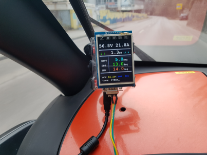
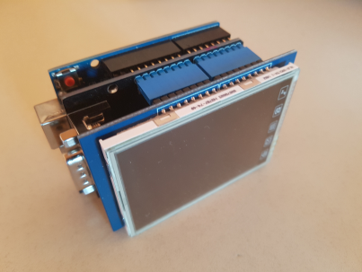
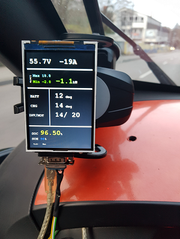

# Twizy_CanDisplay
utilizing Arduino components to display CAN vehicle signals on the example of Renault Twizy

  

This project was born on a Friday evening having a beer and thinking about visualizing a few of the Twizy CAN data by using the omnipresent arduino hardware. 
The first working version took a little longer - mainly to me being unused to designing a display layout with arduino-limitated resources (did you ever do it?).
However in the end it works quite well. The project sources were adjusted as follows
- to use adafruit GFX TFT driver BUT with custom fonts that don't flicker the screen a modified library was used (Zip in this repo)
- the 'redraw per screen-update' was limited to the essential needs

Used components:
1) arduino Uno (8EUR)
   or Mega (11EUR, double ROM!)
2) TFT display ~8.4EUR 
3) Can shield (self-solder connectors, 5EUR)
4) OBD Adapter 10$, look for the _pinout_ when searching alternatives 
   DB9 CAN (for above CAN shield): High Pin3, Low Pin5 !! OVMS adapter does NOT fit~! :(

you should be able to use an arduino mega as well, it holds double the flash for your fonts etc... pin-compatible, slightly longer PCB. 

The cheap CAN shields come with a hard-wired 120Ohms resistor. This didn't make trouble during my testing. Possibly you want to remove it (unsolder or 'destroy').
I tested the 3.5" display (320x480) and made the layout auto-adjusting the screen size (relative positioning of individual signal displays. However the fonts size will not scale along the screen resolution.

Printing (or building) a casing for this CAN display is planed. You find an untested STL file and FreeCAD file in the CAD folder of this repo. 

mediate level: checkout yourself options for bigger TFT (up to 3.5" on _AVR_ or going to where the music plays: who is the first for esp8266/32? - but that is like an OVMS display isn't it :D )

You are invited to have a look at the following feature wishlist for a new Twizy CAN display (probably Esp32 based):

[Feature Requests](http://feathub.com/Jekyll555/Twizy_CanDisplay)

